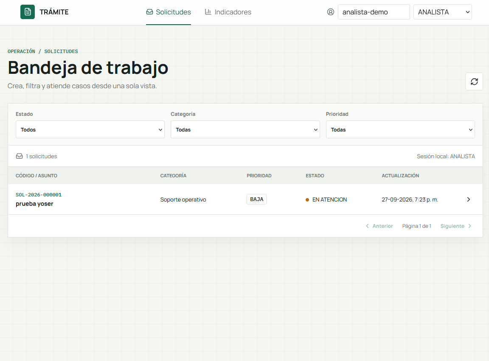
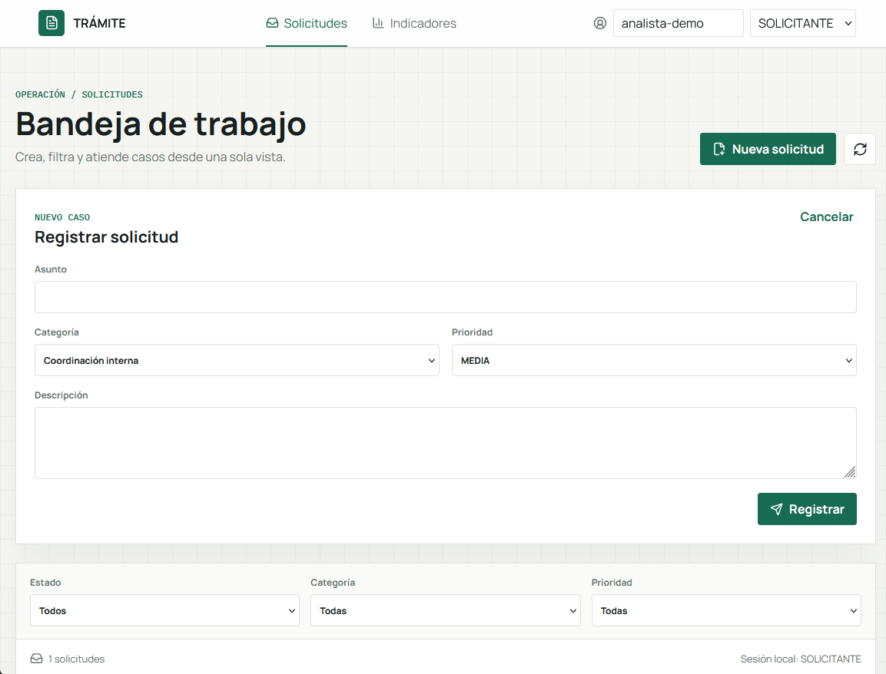
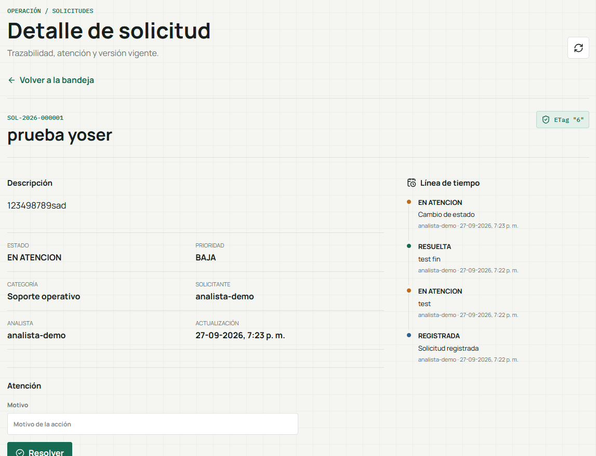

# Gestión de solicitudes e indicadores

Solución distribuida para registrar y atender solicitudes y consultar indicadores derivados.
La escritura operacional y la lectura analítica se desacoplan mediante Outbox, Apache Kafka y una
proyección CQRS idempotente.

## Contenido

- [Arquitectura](#arquitectura)
- [Prerrequisitos](#prerrequisitos)
- [Inicio rápido](#inicio-rápido)
- [Servicios y puertos](#servicios-y-puertos)
- [Usuarios y roles de prueba](#usuarios-y-roles-de-prueba)
- [Demostración](#demostración)
- [Evidencia visual](#evidencia-visual)
- [Pruebas](#pruebas)
- [Contratos](#contratos)
- [Configuración](#configuración)
- [Decisiones](#decisiones)
- [Desarrollador](#desarrollador)
- [Limitaciones](#limitaciones)

## Arquitectura

La solución contiene un frontend React y dos microservicios Java 21/Spring Boot 4.1.1:

- `frontend`: bandeja y detalle de solicitudes con identidad local persistente, navegación restaurable y ETag.
- `ms-solicitudes`: API operacional, reglas de negocio, historial, idempotencia y Outbox.
- `ms-indicadores`: consumidor idempotente y API de consulta sobre una proyección analítica.
- SQL Server: bases independientes `solicitudes_db` e `indicadores_db`.
- Apache Kafka: tópico `solicitudes.v1`, con `aggregateId` como clave de partición.

Documentación:

- [C4 - Contexto](docs/architecture/c4/01-context.md)
- [C4 - Contenedores](docs/architecture/c4/02-containers.md)
- [Secuencia de registro y proyección](docs/architecture/sequences/solicitud-registrada.md)
- [ADR-001 - Outbox y CQRS](docs/architecture/decisions/ADR-001-outbox-cqrs.md)
- [Modelo analítico](docs/data/modelo-analitico.md)

## Prerrequisitos

- Docker Desktop con contenedores Linux.
- Docker Compose v2.
- Al menos 4 GB de memoria disponibles para los contenedores.
- PowerShell para ejecutar el script de demostración.

Java y Maven no son necesarios para el arranque con Docker. Java 21 solo se requiere para ejecutar
los servicios directamente desde el código fuente.

## Inicio rápido

1. Cree la configuración local:

```powershell
Copy-Item .env.example .env
```

2. Cambie `MSSQL_SA_PASSWORD` en `.env`. La contraseña debe cumplir la política de complejidad
de SQL Server. Compose la propaga a ambos microservicios como `DB_PASSWORD`.

3. Construya y levante toda la solución:

```powershell
docker compose up -d --build --wait
```

Compose crea la red y el volumen, espera a SQL Server, ejecuta `sqlserver-init`, aplica las
migraciones Flyway, inicia Kafka, levanta los microservicios y finalmente el frontend.
Compruebe el resultado:

```powershell
docker compose ps -a
Invoke-RestMethod http://localhost:8080/health
Invoke-RestMethod http://localhost:8081/actuator/health
Invoke-RestMethod http://localhost:8082/actuator/health
```

`sqlserver-init` debe aparecer como `Exited (0)`: es un inicializador de ejecución única, no un
servicio permanente. La aplicación queda disponible en `http://localhost:8080/`.

Para detenerla:

```powershell
docker compose down
```

Para eliminar también las bases locales y repetir la inicialización desde cero:

```powershell
docker compose down --volumes
docker compose up -d --build --wait
```

## Servicios y puertos

| Componente | Puerto | Acceso |
|---|---:|---|
| Frontend | `8080` | `http://localhost:8080` |
| API de solicitudes | `8081` | `http://localhost:8081` |
| Swagger solicitudes | `8081` | `http://localhost:8081/swagger-ui.html` |
| API de indicadores | `8082` | `http://localhost:8082` |
| Swagger indicadores | `8082` | `http://localhost:8082/swagger-ui.html` |
| SQL Server | `1433` | `localhost:1433` |
| Kafka | `9092` | Solo red interna de Compose: `kafka:9092` |

## Usuarios y roles de prueba

El perfil `local` permite simular autenticación mediante cabeceras. Estas cabeceras no se usan en
otros perfiles.

| Rol | Identificador sugerido | Capacidades |
|---|---|---|
| `SOLICITANTE` | `solicitante-demo` | Registrar y consultar sus solicitudes. |
| `ANALISTA` | `analista-demo` | Tomar solicitudes, observarlas, resolverlas y consultar indicadores. |
| `SUPERVISOR` | `supervisor-demo` | Reabrir/cerrar solicitudes y consultar indicadores. |

Cabeceras:

```http
X-Local-User-Id: solicitante-demo
X-Local-User-Role: SOLICITANTE
```

## Demostración

Con todos los contenedores saludables, ejecute:

```powershell
.\test-data\validar-endpoints.ps1
```

El script recorre los endpoints, conserva dinámicamente el identificador y el `ETag`, y prueba el
flujo con los distintos roles. También puede ejecutar manualmente
[test-data/todos-los-endpoints.http](test-data/todos-los-endpoints.http) desde VS Code.

Después de registrar una solicitud, el publicador Outbox la envía a Kafka y `ms-indicadores`
actualiza su proyección. La propagación es eventualmente consistente y puede tardar algunos segundos.

## Evidencia visual

### Bandeja de solicitudes

Vista de trabajo para filtrar solicitudes y revisar su estado, prioridad y última actualización.



### Registro de solicitud

Formulario disponible para el rol `SOLICITANTE`, con selección de categoría y prioridad.



### Detalle y trazabilidad

Detalle operacional con versión `ETag`, estado vigente, información de atención y línea de tiempo.



## Pruebas

Para ejecutar las pruebas fuera de Docker, levante al menos SQL Server y use Java 21:

```powershell
docker compose up -d sqlserver sqlserver-init

Set-Location backend/ms-solicitudes
.\mvnw.cmd test

Set-Location ../ms-indicadores
.\mvnw.cmd test
```

Las pruebas de repositorio marcadas para perfil local requieren SQL Server disponible. Los reportes
JUnit se generan en `backend/<servicio>/target/surefire-reports` y no se versionan.

## Contratos

- [OpenAPI de solicitudes](contracts/openapi/solicitudes-api-v1.yaml)
- [OpenAPI de indicadores](contracts/openapi/indicadores-api-v1.yaml)
- [Catálogo y contratos de eventos](contracts/events/README.md)
- [SolicitudRegistrada v1](contracts/events/solicitud-registrada-v1.schema.json)
- [SolicitudTomada v1](contracts/events/solicitud-tomada-v1.schema.json)
- [SolicitudResuelta v1](contracts/events/solicitud-resuelta-v1.schema.json)
- [SolicitudCerrada v1](contracts/events/solicitud-cerrada-v1.schema.json)

Cada microservicio aplica sus migraciones Flyway desde `src/main/resources/db/migration` durante el arranque.

## Configuración

| Variable | Descripción | Valor local predeterminado |
|---|---|---|
| `SPRING_PROFILES_ACTIVE` | Perfil de ejecución. | `local` |
| `MSSQL_SA_PASSWORD` | Contraseña local de SQL Server. | Debe definirse en `.env`. |
| `DB_URL` | URL JDBC; Compose define una distinta por servicio. | Definida por Compose. |
| `DB_USERNAME` | Usuario SQL Server local. | `sa` |
| `DB_PASSWORD` | Contraseña JDBC para ejecución directa; Compose usa `MSSQL_SA_PASSWORD`. | Debe coincidir con `MSSQL_SA_PASSWORD`. |
| `KAFKA_BOOTSTRAP_SERVERS` | Brokers Kafka. | `kafka:9092` en Compose. |
| `SOLICITUDES_TOPIC` | Tópico de eventos. | `solicitudes.v1` |
| `KAFKA_CONSUMER_GROUP` | Grupo del proyector analítico. | `indicadores-v1` |
| `OUTBOX_FIXED_DELAY` | Intervalo de publicación en milisegundos. | `1000` |
| `SWAGGER_ENABLED` | Habilita OpenAPI y Swagger UI. | `true` |
| `LOCAL_USER_ID` | Identidad técnica fuera de una petición. | `local-user` |
| `LOCAL_USER_ROLE` | Rol técnico local. | `SOLICITANTE` |

El archivo `.env` está excluido de Git. No use credenciales productivas en esta solución local.

## Decisiones

- Contratos OpenAPI como fuente para generar interfaces y DTOs REST.
- Base de datos por servicio y migraciones Flyway con `ddl-auto=validate`.
- Outbox para consistencia entre escritura operacional y publicación.
- Entrega Kafka al menos una vez e idempotencia persistente en el consumidor.
- Modelo CQRS de lectura especializado para resumen y tendencia.
- Autenticación simplificada por cabeceras exclusivamente en el perfil local.

## Desarrollador

- **Nombre:** Yoser Perez
- **Correo:** [yoserp1@gmail.com](mailto:yoserp1@gmail.com)
- **Web:** [yoserp1.cloud](https://yoserp1.cloud/)

## Limitaciones

- El entorno local usa un único broker Kafka y una única instancia SQL Server; no representa alta disponibilidad.
- Kafka crea el tópico automáticamente para simplificar la evaluación local.
- Los mensajes no procesables aún no se redirigen a una DLQ durable.
- No se incluye despliegue público ni proveedor de identidad local.
- La suite actual no publica un porcentaje de cobertura; los reportes disponibles son JUnit/Surefire.

Consulte [USO_DE_IA.md](USO_DE_IA.md) para la declaración de asistencia utilizada en la solución.
