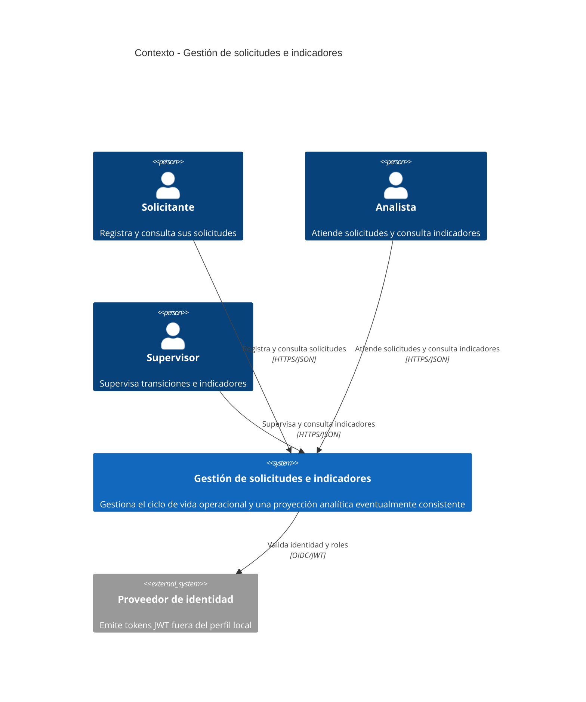

# C4 Nivel 1 - Contexto del sistema

El sistema permite registrar y gestionar solicitudes, y consultar indicadores derivados de sus eventos.

## Notas

- En desarrollo local, las cabeceras `X-Local-User-Id` y `X-Local-User-Role` sustituyen al proveedor de identidad.
- La lectura analítica puede presentar un retraso breve respecto de la escritura operacional.
- La vista editable está en `diagrams/01-context.drawio`.
