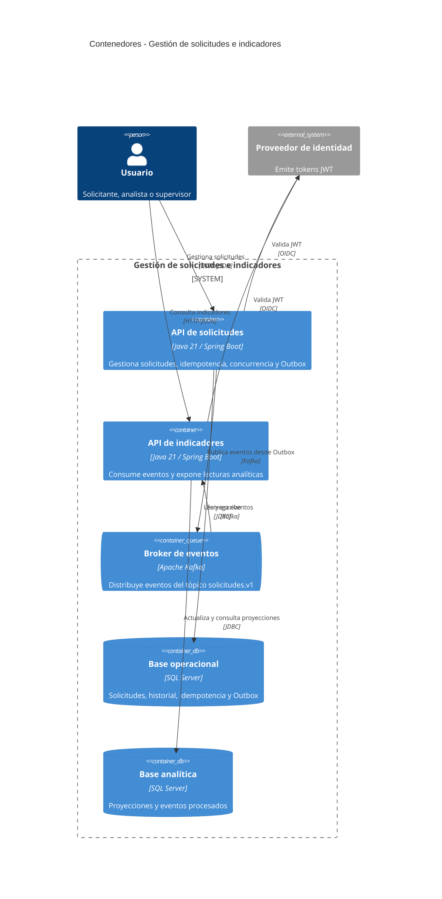

# C4 Nivel 2 - Contenedores

## Decisiones relevantes

- Cada servicio es dueño de su esquema y ejecuta migraciones Flyway al arrancar.
- La clave Kafka es `solicitudId`, por lo que se conserva el orden dentro de cada agregado.
- La entrega es al menos una vez y el consumidor deduplica mediante `evento_procesado`.
- La vista editable está en `diagrams/02-containers.drawio`.
