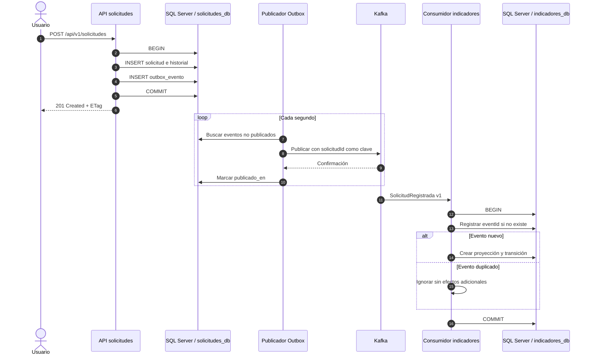

# Secuencia - Registro y proyección de una solicitud

Si la publicación falla, el registro permanece pendiente y se reintenta. Si el proceso cae después de publicar y antes de marcar el Outbox, Kafka puede entregar un duplicado; la deduplicación persistente evita aplicar dos veces el mismo evento.
