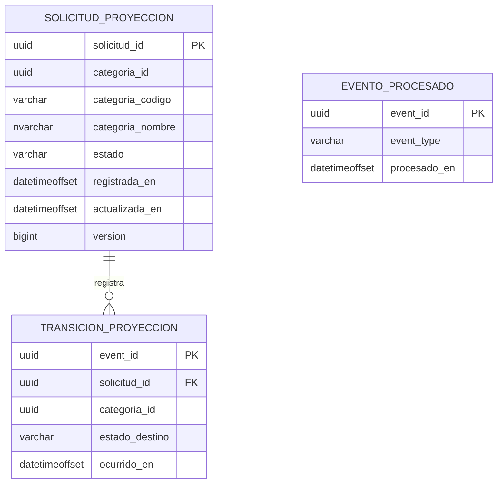

# Modelo analítico

El modelo es una proyección CQRS orientada a las consultas de resumen y tendencia. No replica campos operacionales que no participan en los indicadores.

## Uso de las tablas

| Tabla | Propósito |
|---|---|
| `solicitud_proyeccion` | Estado vigente y atributos mínimos para agrupar por período, estado y categoría. |
| `transicion_proyeccion` | Hechos temporales usados para la tendencia diaria. |
| `evento_procesado` | Control idempotente de eventos consumidos. |

## Consistencia

La proyección es eventualmente consistente. `actualizadoHasta` se calcula desde la fecha máxima de `evento_procesado`. La transacción del consumidor registra el evento y modifica la proyección de manera atómica.

## Índices

- `ix_proyeccion_periodo (registrada_en, categoria_id, estado)` soporta el resumen.
- `ix_transicion_tendencia (ocurrido_en, categoria_id, estado_destino)` soporta la serie diaria.

Las migraciones fuente están en `backend/ms-indicadores/src/main/resources/db/migration`.
